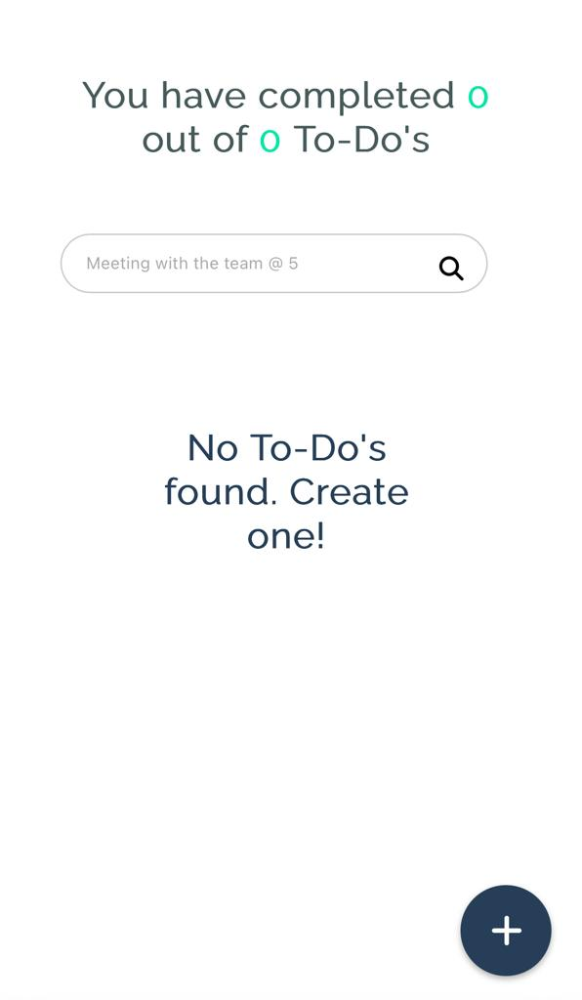
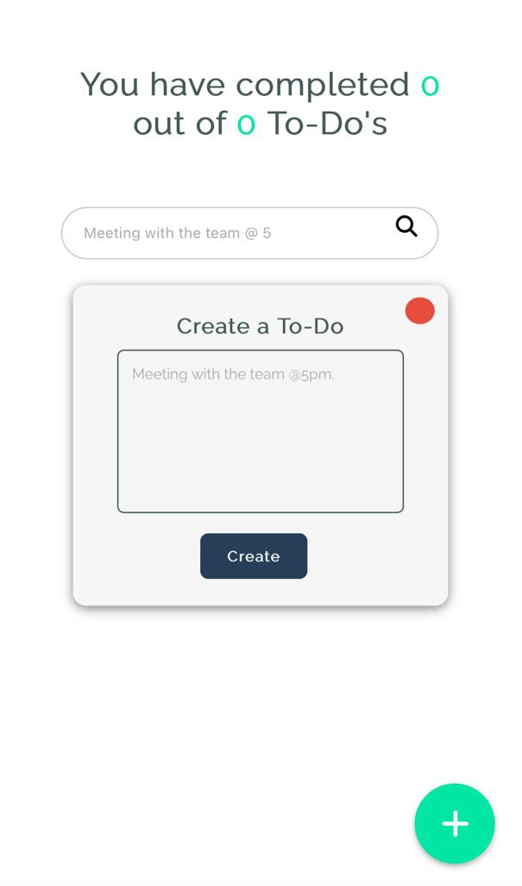
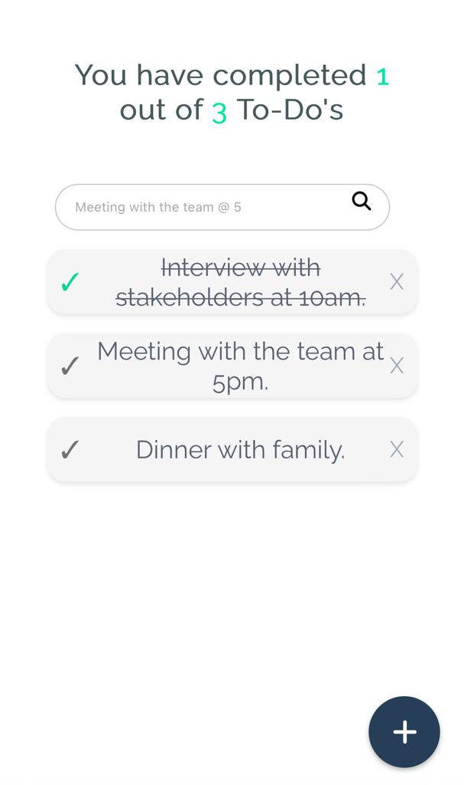

# To-Do Machine

Welcome to To-Do Machine, a simple and user-friendly application that helps you manage your tasks efficiently. With To-Do Machine, you can create, track, mark as done, and delete tasks effortlessly.

This project was created as part of the React course from Platzi. It serves as a practical implementation of the concepts and techniques learned throughout the course.

## Features

- Create new tasks with ease.
- Mark tasks as completed to keep track of your progress.
- Delete tasks that are no longer needed.
- Filter tasks by name to focus on specific items.
- Intuitive and responsive user interface for a seamless experience.

## Technologies Used

- React.js: A JavaScript library for building user interfaces.
- HTML5: Markup language for structuring the application.
- CSS3: Styling language for designing the user interface.
- JavaScript: Programming language for implementing application logic.

## Deployment 💻

https://dvnielx.github.io/to-do-machine-react/